  

<h3>
🌌 Building modern web applications, Web3 products & automation tools
</h3>

 

 

---

<h2 align="center">🌌 About Me</h2>

<table align="center">
<tr>

<td width="50%" valign="top">

### 👨‍🚀 Who I Am

🌍 Based in **Vietnam**

💻 **Full-Stack Developer** with **3+ years** of hands-on experience

⛓️ Focused on **Web3, Blockchain & Full-Stack Development**

⚙️ Building **automation tools & scalable systems**

🚀 Working with **React, Next.js, Node.js & DevOps**

🤖 Using **ChatGPT & Claude** to accelerate development

🎮 I enjoy playing **TFT ^^**

</td>

<td width="50%" valign="top">

### 🚀 What I Build

✨ Full-stack web applications

⛓️ Web3 & blockchain products

💰 On-chain payment & reward systems

🛠️ Automation tools and workflows

⚙️ Backend APIs & scalable architecture

🚢 CI/CD & production deployment

🎨 Clean and user-friendly interfaces

</td>

</tr>
</table>

---

<h2 align="center">🪐 Tech Universe</h2>

<table align="center">
<tr>

<td width="50%" valign="top">

### 🎨 Frontend

### ⚙️ Backend

### 🗄️ Database

</td>

<td width="50%" valign="top">

### ⛓️ Web3

### 🚀 DevOps & Tools

</td>

</tr>
</table>

---

## 🚀 Featured Projects

<table>
<tr>

<td width="50%" valign="top">

<h3 align="center">❄️ Snowryv</h3>

<b>Web3 eSports Tournament Platform</b>

A Web3 platform combining competitive gaming with blockchain infrastructure.

**Core features**

🏆 Tournament management  
💰 Smart contract prize pools  
🎟️ NFT-based tournament systems  
⚡ Automatic on-chain rewards  
🎮 Competitive gaming infrastructure  

</td>

<td width="50%" valign="top">

<h3 align="center">💎 PubCrypto</h3>

<b>Crypto Reward & Advertising Platform</b>

A crypto rewards ecosystem connecting users, publishers and advertising campaigns.

**Core features**

💵 Crypto reward system  
📢 Advertising campaigns  
🔗 Publisher integrations  
⚙️ Automated reward workflows  
🔐 Backend security systems  

</td>

</tr>
</table>

---

## 📊 GitHub Universe

  

<table>
<tr>

<td width="50%" align="center">

</td>

<td width="50%" align="center">

</td>

</tr>

<tr>

<td width="50%" align="center">

</td>

<td width="50%" align="center">

</td>

</tr>

</table>

---

## 🐍 Contribution Galaxy

<picture>

<!-- <source
  media="(prefers-color-scheme: dark)"
  srcset="https://raw.githubusercontent.com/Tuan-Dang05/Tuan-Dang05/output/github-contribution-grid-snake-dark.svg"
/>

<source
  media="(prefers-color-scheme: light)"
  srcset="https://raw.githubusercontent.com/Tuan-Dang05/Tuan-Dang05/output/github-contribution-grid-snake.svg"
/>

 -->

</picture>

---

## 🌠 Let's Connect

I'm always interested in building useful products, exploring Web3 ideas  
and working on challenging projects.

  

  

